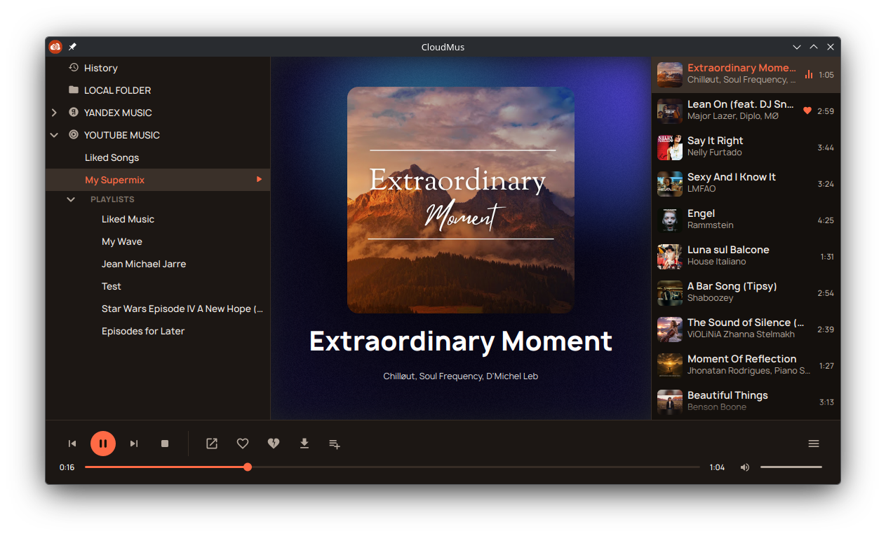

<p align="center">
  
</p>

<h1 align="center">CloudMus</h1>

<p align="center">
  A multi-source music player built on a front/backend split<br>
  over JSON-RPC 2.0
</p>

<p align="center">
  
</p>

---

CloudMus is a music player where the UI and the music services it plays from
are separated by a clean protocol boundary. Each music service (Yandex
Music, YouTube Music, a local folder, and eventually Spotify, internet
radio, and others) runs as its own **backend** process, talking to a UI
**front** over JSON-RPC 2.0 via stdin/stdout. Adding a new service means
writing a small adapter — the UI code never has to change.

## Download and install

CloudMus for Linux is published as an **AppImage** — a single file that
bundles the desktop app, all the backends, Qt, libmpv and Python, so
nothing else needs to be installed.

1. Download `CloudMus-<version>-x86_64.AppImage` from the
   [latest release](https://github.com/cloudmus/cloudmus/releases/latest).
2. Make it executable and run it:

   ```bash
   chmod +x CloudMus-*-x86_64.AppImage
   ./CloudMus-*-x86_64.AppImage
   ```

   (or tick *Allow executing file as program* in the file's properties and
   double-click it).

On the first launch CloudMus adds itself to the application menu
(`~/.local/share/applications/cloudmus-qt.desktop`), so afterwards it can
be started from there. Keep the AppImage where you put it — the menu entry
points at that file; if you move it, launch it once from the new place.

**Requirements:** x86_64 Linux with glibc 2.31 or newer (Debian 11,
Ubuntu 20.04, Fedora 32, openSUSE Leap 15.3 or later). If the AppImage
refuses to start with a FUSE error, install `libfuse2` (`libfuse2t64` on
Ubuntu 24.04+), or run it with `--appimage-extract-and-run`.

**Updating:** download the new release's AppImage and replace the old file.

**Uninstalling:** delete the AppImage,
`~/.local/share/applications/cloudmus-qt.desktop` and the
`cloudmus-qt.png`/`cloudmus-qt.svg` icons under `~/.local/share/icons/hicolor/`.
Settings, sign-in tokens and history live in `~/.config/cloudmus/`, cached
covers in `~/.cache/cloudmus/` — delete them too to remove everything.

### First steps

- **Yandex Music** — sign in from the service's page in the sidebar: the
  app shows a code to enter on Yandex's site.
- **YouTube Music** — sign-in is done by pasting request headers copied
  from a logged-in browser session, see
  [Setting up browser-header auth](backends/youtube-music/README.md#setting-up-browser-header-auth).
- **Local folder** — plays your music folder (`xdg-user-dir MUSIC`, e.g.
  `~/Music` or `~/Музыка`), each subfolder shown as a playlist. To use
  another folder, put `{"musicDir": "/path/to/music"}` into
  `~/.config/cloudmus/backends/local-folder/config.json`.
- **Downloads** go to the same music folder unless you pick another one in
  Settings.

## What makes this different from a regular player

Most players hardcode support for specific services directly into the UI.
In CloudMus, the only thing that's stable is the **protocol** — JSON-RPC 2.0
over stdin/stdout, framed as NDJSON (one JSON object per line). Everything
else is an implementation detail of the process on either side:

- **The front and the backend don't have to share a language.** Today
  there's Python (the TUI, every backend) and C++/Qt (the desktop app);
  nothing stops a front written in Rust or a backend written in Go — see
  `protocol/README.md`.
- **Each backend decides how audio actually plays.** Either it hands the
  front a stream URL (`providesStream`), in which case one shared mpv
  instance on the front side does the playing — giving every source the
  same volume/seek UX — or it plays audio itself (`selfPlayback`), for
  services with no usable direct stream (DRM, Chromecast-like targets).
- **Capabilities are negotiated at startup.** A backend declares what it
  supports (playlists, likes, radio, downloads, the auth flow it needs),
  and the front adapts its UI to what's actually available instead of
  branching on `if backend == "yandex": ...` in interface code.
- **A network transport is possible in theory** (the same JSON-RPC over a
  socket instead of stdio), but it isn't implemented and isn't needed yet —
  stdio comfortably covers every current use case.

## Architecture

```
      ┌─────────────────────┐      ┌─────────────────────┐
      │    TUI (Textual)    │      │ Qt6 Desktop (C++20) │
      └─────────────────────┘      └─────────────────────┘
                 │                            │
                 └─────────────┴──────────────┘
                               │   JSON-RPC 2.0 / NDJSON over stdin/stdout
                               │   one child process per backend
         ┌─────────────────────┴─────────────────────┐
         │                     │                     │
┌─────────────────┐   ┌─────────────────┐   ┌─────────────────┐
│  Yandex Music   │   │  Local Folder   │   │  YouTube Music  │
│     backend     │   │     backend     │   │     backend     │
└─────────────────┘   └─────────────────┘   └─────────────────┘
```

On startup, the front scans backend manifests, spawns each backend as a
child process, performs the handshake, and then talks to it over the
protocol: catalog browsing, playback, radio, likes, downloads.

## Backends

| Backend | Description | Auth | Playlists / likes | Radio | Download |
|---|---|---|---|---|---|
| `backends/yandex-music` | [Yandex Music](https://music.yandex.ru) | deviceCode (OAuth) | yes | My Wave | yes |
| `backends/youtube-music` | [YouTube Music](https://music.youtube.com) | browser headers* | yes | from a track | yes |
| `backends/local-folder` | A local music folder (subfolders → playlists) | none | playlists | — | — |

Your own playlists on Yandex Music and YouTube Music can be edited: add the
playing track to a playlist or remove it, from the toolbar, the track menu,
or the tray. Search isn't implemented yet in any backend.

\* YouTube Music: device-code OAuth is currently broken on Google's side
([sigma67/ytmusicapi#676](https://github.com/sigma67/ytmusicapi/issues/676)),
so this backend uses a workaround based on pasting browser request headers.
See `backends/youtube-music/README.md`.

The list of sources isn't fixed — a new backend (Spotify, internet radio,
SoundCloud, VK, etc.) is added as a standalone adapter process without
touching any front, see [Adding a new backend](#adding-a-new-backend).

## Fronts

| Front | Description | Stack |
|---|---|---|
| `fronts/tui` | Terminal player | Python 3.11+, Textual, python-mpv |
| `fronts/qt` | Desktop application (the one shipped as an AppImage) | C++20, Qt 6, libmpv, CMake |

The Qt front additionally provides: light and dark themes, a system tray
icon (playback controls, like/dislike, playlists), MPRIS (D-Bus)
integration, KDE global shortcuts, desktop notifications for each track,
playback history, a queue view, and cover art caching.

## Building from source

### Requirements

- Python ≥ 3.11
- `libmpv` (install via your OS package manager; the Qt front also needs
  its development package and `pkg-config`)
- `jinja2`, `pyyaml` (for protocol code generation)
- For the Qt front: Qt 6 (Core, Widgets, Network, DBus, Svg), CMake ≥ 3.21,
  a C++20 compiler; `clang-format` to format generated code (optional)

### Install

```bash
# Virtual environment
python3 -m venv .venv && source .venv/bin/activate

# Generate typed protocol stubs (Python + C++)
pip install jinja2 pyyaml
python protocol/codegen/generate.py --lang python cpp

# Install the shared transport, all backends, and the TUI front
pip install -e backends/py-rpc-common
pip install -e backends/yandex-music
pip install -e backends/local-folder
pip install -e backends/youtube-music
pip install -e fronts/tui
```

### Run the TUI

```bash
cloudmus
# or:
python -m cloudmus_tui
```

### Run the Qt front

```bash
cmake -S fronts/qt -B fronts/qt/build
cmake --build fronts/qt/build
CLOUDMUS_DEV_BACKENDS=1 ./fronts/qt/build/bin/cloudmus-qt
```

CMake automatically regenerates the C++ protocol stubs at configure time.
`CLOUDMUS_DEV_BACKENDS=1` makes it run the backends from this checkout
(with its `.venv`) — see Development mode below.

### Build the AppImage

```bash
./build-appimage.sh   # -> dist/CloudMus-x86_64.AppImage
```

Needs only Docker: the build runs in a Debian 11 container (see
`packaging/appimage/`), which sets the glibc floor above.

### Releases

Pushing a tag of the form `x.y.z` (e.g. `0.1.0`) runs
`.github/workflows/release.yml`: it builds the AppImage and attaches it to
that tag's GitHub release, creating the release if it doesn't exist yet.
The app's version (shown in the About dialog) comes from the same tag via
`git describe`. Release notes are kept in [`CHANGELOG.md`](CHANGELOG.md).

### Development mode

```bash
export CLOUDMUS_DEV_BACKENDS=1  # front discovers backends from the repo checkout
```

## Tests

```bash
# All backend tests, from the repo root
pytest backends/

# TUI tests
cd fronts/tui && python -m pytest tests/ -q

# Conformance suite (validates against the JSON schemas)
python -m rpc_common.testing.conformance python3 -m cloudmus_backend_yandex
python -m rpc_common.testing.conformance python3 -m cloudmus_backend_local
python -m rpc_common.testing.conformance python3 -m cloudmus_backend_ytmusic
```

The root `pyproject.toml` isn't a package — it only holds a pytest
`addopts` setting (`--import-mode=importlib`) so `pytest backends/` doesn't
collide when two backends' `tests/` directories both have a file with the
same name (e.g. two `test_catalog.py`, neither package-marked with
`__init__.py`). It's required for that command to work from the repo root.

## Protocol

The protocol is described in `docs/protocol.md`; its version history is in
`docs/protocol-changelog.md`. Data schemas and the
RPC surface are defined as YAML under `protocol/`:

- `protocol/schema/*.yaml` — types (Track, Playlist, PlaybackState, ...)
- `protocol/methods.yaml` — methods, notifications, error codes
- `protocol/codegen/` — the Python/C++ stub generator (Jinja2)

Generated code is a build artifact (gitignored) and is regenerated before
building/testing. See `protocol/README.md` for details.

### Key protocol features

- **NDJSON framing** — one JSON value per line, UTF-8
- **Capability negotiation** — a backend declares its capabilities at handshake
- **providesStream** — a backend hands back a stream URL; the front plays it via mpv
- **Radio / My Wave** — a backend pushes new tracks; the front reports listening feedback
- **Download** — a backend saves a track's audio into a folder the front specifies
- **Playlist editing** — a backend marks which playlists are editable and adds/removes tracks

## Configuration

| Path | Description |
|---|---|
| `~/.config/cloudmus/backends.d/*.json` | Backend manifests (production) |
| `~/.config/cloudmus/backends/<id>/` | Per-backend data (tokens, settings) |
| `~/.config/cloudmus/fronts/qt/config.ini` | Qt front settings |
| `~/.config/cloudmus/fronts/qt/debug.log` | Qt front debug log (with `CLOUDMUS_QT_DEBUG=1`) |

### Environment variables

| Variable | Description |
|---|---|
| `CLOUDMUS_DEV_BACKENDS=1` | Dev mode: discover backends from the repo checkout |
| `CLOUDMUS_TUI_DEBUG=1` | Debug log for the TUI, written to `./cloudmus-tui-debug.log` |
| `CLOUDMUS_QT_DEBUG=1` | Debug log for the Qt front (or run it with `--debug`) |
| `CLOUDMUS_LOCAL_FOLDER_MUSIC_DIR` | Overrides the local-folder backend's music folder |

## Adding a new backend

1. Create a folder under `backends/<service-name>/`
2. Write a `manifest.json` (id, name, argv, protocolVersion, and optionally
   `icon`: a monochrome 24×24 SVG, path relative to the manifest — the Qt
   front tints it to match its theme). Outside dev mode, fronts discover
   backends from manifests in `~/.config/cloudmus/backends.d/` — including
   the AppImage, so a backend of your own can be used with it too
3. Implement the protocol methods: `initialize`, `catalog.*`, `playback.*`, ...
4. Use `backends/py-rpc-common` as the shared transport
5. Validate it against the conformance suite

## Repository layout

```
cloudmus/
├── protocol/          # Protocol schemas + codegen (Python, C++)
│   ├── schema/        # JSON Schema draft-07 types
│   ├── methods.yaml   # RPC surface
│   └── codegen/       # Stub generator
├── backends/
│   ├── py-rpc-common/ # Shared NDJSON/JSON-RPC transport (Python)
│   ├── yandex-music/  # Yandex Music backend
│   ├── local-folder/  # Local folder backend
│   └── youtube-music/ # YouTube Music backend
├── fronts/
│   ├── tui/           # TUI front (Python, Textual)
│   └── qt/            # Desktop front (C++20, Qt 6)
├── packaging/appimage/ # AppImage build (Dockerfile, AppRun, build script)
├── .github/workflows/ # Release build
├── docs/              # Architecture and protocol prose
├── art/               # Logo
└── CHANGELOG.md       # Release notes
```

## License

MIT — see [LICENSE](LICENSE).
