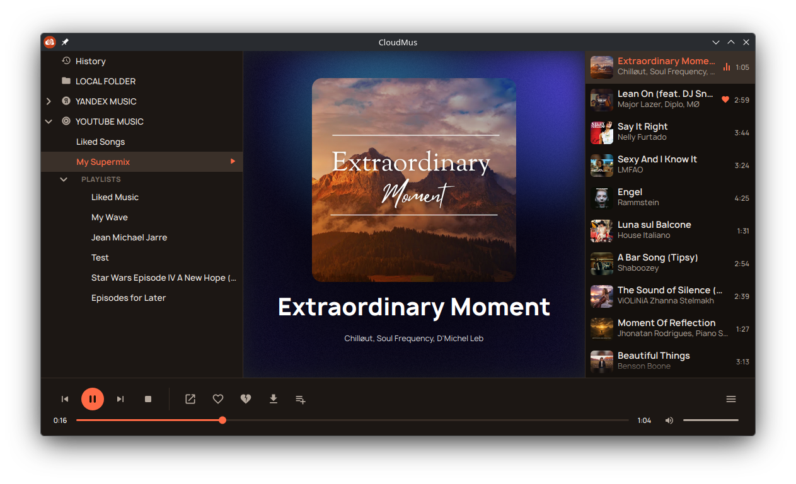

<p align="center">
  
</p>

<h1 align="center">CloudMus</h1>

<p align="center">
  A beautiful desktop music player for all your music services at once
</p>

<p align="center">
  
</p>

---

CloudMus — *cloud music* — brings Yandex Music, YouTube Music and your
local music folder into one native desktop app for Windows and Linux: a
glass window that blurs your desktop behind it, big cover art, smooth animations, light
and dark themes. No browser tabs, no Electron wrappers: one fast player with the
same controls for every service.

Two streaming services are supported today, and more are on the way:
Spotify, Apple Music, SoundCloud, TuneIn, VK Music, Zvuk (Sber) and others.

## Why CloudMus

- **Every service in one place** — switch between Yandex Music, YouTube
  Music and your own files in the same sidebar, with one queue, one
  history and one set of controls. More services can be added as plug-ins.
- **Looks great** — a frosted-glass background (acrylic on Windows 11,
  blur on Windows 10, real blur on KDE Plasma and Wayland compositors,
  see-through on GNOME with Blur my Shell), light, dark or system theme, hero panels with large covers, overlay scrollbars
  and animated transitions.
- **Endless personal radio** — Yandex My Wave and personal playlists
  (Playlist of the Day, Déjà Vu, Premiere…), YouTube Music mixes
  (My Supermix, My Mix 1–7, Discover, Replay), radio from any track; pin
  your favorite stations to the sidebar.
- **No waiting between tracks** — the next track is preloaded while the
  current one plays, and the seek bar shows what's already buffered.
- **Downloads** — save single tracks or whole playlists, follow and cancel
  them in the downloads panel, sort them into folders by source, artist or
  album.
- **Your library, editable** — like and dislike, add the playing track to
  your playlists or remove it, from the toolbar, the track menu or the tray.
- **Part of your desktop** — on Windows and Linux alike: tray icon with
  playback controls, media keys, track notifications, launch at login.
  On Windows the player shows up in the volume flyout and quick settings;
  on Linux it speaks MPRIS (seek, volume, shuffle, repeat) and supports
  KDE global shortcuts.
- **Proxies per service** — HTTP and SOCKS5 proxies, chosen per source;
  streams and covers go through them too.
- **Picks up where you left off** — the last playlist and track are
  restored on start; everything you play lands in History.
- **Self-contained downloads** — an AppImage for Linux and an installer for Windows.

## Download and install

CloudMus runs on **Windows** and **Linux** (x86_64). Both downloads are on
the [latest release](https://github.com/cloudmus/cloudmus/releases/latest)
page.

### Windows

**Requirements:** Windows 10 or 11, x64.

1. Download `CloudMus-<version>-x86_64-Setup.exe` from the
   [latest release](https://github.com/cloudmus/cloudmus/releases/latest).
2. Run it. It installs for the current user without administrator
   rights.

**Updating:** close CloudMus and run a newer installer.

**Uninstalling:** remove CloudMus through Windows Settings. Settings and
sign-in data are kept under `%APPDATA%\cloudmus`, and caches under
`%LOCALAPPDATA%\cloudmus` — delete them too to remove everything.

What works on Windows:

- glass background: acrylic blur behind the window, menus and popups on
  Windows 11, blur on Windows 10;
- tray icon with playback controls;
- track notifications;
- launch at login;
- media keys and the media card in the volume flyout and quick settings,
  through System Media Transport Controls (SMTC).

### Linux

CloudMus for Linux is published as an [**AppImage**](https://appimage.org/)
— a single file that bundles everything it needs.

**Requirements:** x86_64 Linux with glibc 2.31 or newer (Debian 11,
Ubuntu 20.04, Fedora 32, openSUSE Leap 15.3 or later).

1. Download `CloudMus-<version>-x86_64.AppImage` from the
   [latest release](https://github.com/cloudmus/cloudmus/releases/latest).
2. Make it executable and run it:

   ```bash
   chmod +x CloudMus-*-x86_64.AppImage
   ./CloudMus-*-x86_64.AppImage
   ```

   (or tick *Allow executing file as program* in the file's properties and
   double-click it).

On the first launch CloudMus adds itself to the application menu, so
afterwards it can be started from there. Keep the AppImage where you put
it — the menu entry points at that file; if you move it, launch it once
from the new place.

If the AppImage refuses to start with a FUSE error, install `libfuse2`
(`libfuse2t64` on Ubuntu 24.04+), or run it with
`--appimage-extract-and-run`.

**Updating:** download the new release's AppImage and replace the old file.

**Uninstalling:** delete the AppImage,
`~/.local/share/applications/cloudmus-qt.desktop` and the
`cloudmus-qt.png`/`cloudmus-qt.svg` icons under `~/.local/share/icons/hicolor/`.
Settings, sign-in tokens and history live in `~/.config/cloudmus/`, cached
covers in `~/.cache/cloudmus/` — delete them too to remove everything.

What works on Linux:

- glass background: real blur on KDE Plasma and Wayland compositors with
  the standard blur protocol, see-through on GNOME with an extension such
  as Blur my Shell;
- tray icon with playback controls;
- track notifications with covers;
- launch at login;
- media keys and desktop media widgets through MPRIS (seek, volume,
  shuffle, repeat);
- global shortcuts on KDE Plasma.

## First steps

Sources are switched on and off, signed in and configured in
**Settings**, one page per source.

- **Yandex Music** — sign in from the service's page: the app shows a code
  to enter on Yandex's site.
- **YouTube Music** — sign in by pasting request headers copied from a
  logged-in browser session (Google's own device sign-in is currently
  broken, [sigma67/ytmusicapi#676](https://github.com/sigma67/ytmusicapi/issues/676)).
  Step-by-step: [Setting up browser-header auth](backends/youtube-music/README.md#setting-up-browser-header-auth).
- **Local folder** — plays your Music folder (XDG Music on Linux, the Windows
  Music known folder on Windows), each subfolder shown as a playlist; another folder can be
  picked in the source's settings.
- **Downloads** are off until turned on in Settings; they go to the same
  music folder unless you choose another one.

## Supported services

| Service | Sign-in | Playlists & likes | Radio | Downloads |
|---|---|---|---|---|
| [Yandex Music](https://music.yandex.ru) | code on Yandex's site | yes, editable | My Wave, stations | yes |
| [YouTube Music](https://music.youtube.com) | browser headers | yes, editable | personal mixes, from a track | yes |
| Local folder | — | subfolders as playlists | — | — |

Search isn't available yet. More services are planned — see above.

## Settings and troubleshooting

- Settings, sign-in tokens and history: `~/.config/cloudmus/`; cached
  covers: `~/.cache/cloudmus/`.
- To report a bug, run the app with `--debug` (or `CLOUDMUS_QT_DEBUG=1`)
  and attach `~/.config/cloudmus/fronts/qt/debug.log`.
- CloudMus sends anonymous usage statistics, which can be turned off in
  **Settings → General** — see [what is sent](docs/analytics.md).

There is also a terminal version of the player; it's run from source, see
the developer guide.

## For developers

- [Developer guide](docs/development.md) — architecture, building from
  source, tests, adding a new music service
- [Protocol specification](docs/protocol.md) and its
  [changelog](docs/protocol-changelog.md)
- [Changelog](CHANGELOG.md)

## License

MIT — see [LICENSE](LICENSE).
